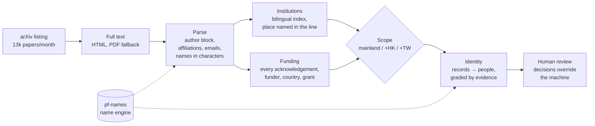

# Parallel Frontier: the tools

**Who is building China's AI, who pays for it, and how do we know?**

The analytic tooling behind [Parallel Frontier](https://parallelfrontier.ai), which covers the Chinese and Russian AI
ecosystems from primary-language sources. Built and evaluated by [Caroline Swartz](https://linkedin.com/in/carolineswartz).

Most English-language analysis of Chinese AI can't tell 王伟 from 王薇. It can't see that "Tang Shu-wing" and 鄧樹榮 are
the same person, and it counts a paper as "Chinese" because an author has a Chinese name. These tools read the papers
themselves: every affiliation line, every funding acknowledgement, and every name in every script. Each call they
make comes with its evidence and a measured error rate.

> The source code is private. This repository describes what the tools do and how well they do it.
> For a walkthrough or code access, get in touch via [parallelfrontier.ai](https://parallelfrontier.ai).

## One month of AI research, read end to end

Every new arXiv paper in ten AI categories, August 2026:

| | |
|---|---|
| Papers read in full | **13,288** |
| With an author in mainland China or Hong Kong | **3,995** (30%) |
| Affiliation calls, precision / recall | **99% / 97.5%** (366-paper random sample) |
| Chinese funders detected, precision / recall | **100% / 76%** |
| Author matches confirmed by hard evidence | **23,055** (email, ORCID, grant, or identical characters plus corroboration) |
| Institutions recognised, in English and Chinese | **~8,800** across mainland China, Hong Kong, Macau and Taiwan |
| Hong Kong names matched to their characters | **13% → 37%** after adding Cantonese readings, with 0.3% false matches |

A separate model pass labelled the sample, blind to the tool's output, and a human re-check is under way. How each
number was measured is in [evaluation](docs/evaluation.md).

## How it works



**Two tools, one pipeline:**

- **`pf-names`**, a Chinese name engine. It matches a name across characters, pinyin, Wade-Giles (Taiwan), Cantonese
  (Hong Kong, Macau) and the Hokkien, Teochew and Hakka spellings of Singapore and Malaysia. Every comparison returns
  a weight of evidence and a reason. [How it works →](docs/names.md)
- **`pf-authors`**, the arXiv pipeline. It maps each affiliation to an institution and the place it names, extracts
  every funder, decides scope under saved definitions without re-running anything, and links author records into
  people. [How it works →](docs/pipeline.md)

```text
"Tang Shu-wing"  vs 鄧樹榮  → match       Hong Kong spelling of the Cantonese reading
"Boon Keng Tan"  vs 陈文庆  → match       Singapore Hokkien spelling
"Chia-Hsin Chang" vs 张家欣 → match       Taiwan Wade-Giles
王伟             vs 王薇    → conflict    same pinyin, different characters, different person
```

## Design principles

- **A name never implies nationality, affiliation or funding.** Names identify people; they never classify them.
  Nothing enters scope because of a name.
- **Evidence or it didn't happen.** Every fact traces to its source sentence. Unknown stays unknown. Analytic judgements
  keep likelihood and confidence apart (ICD 203).
- **Measured, not asserted.** Every headline number comes from a blind random sample or a held-out test set, with 95%
  intervals.
- **The machine proposes, a person decides.** Reviewed decisions override the machine and survive re-runs.
- **Privacy by design.** Researcher data never leaves the analyst's machine. The review app binds to localhost only.
  No photos and no facial recognition. Tests use invented people only.

## Engineering

- Python 3.10+, SQLite (WAL), deterministic parsing. The only model is an optional small local embedding model for
  topic similarity.
- Log-likelihood-ratio identity matching, calibrated on real same-person pairs.
- Institution index built from ROR (CC0) plus curated acronyms, admitted only when unambiguous.
- Cantonese readings from the Unicode Han Database, converted from Jyutping to Hong Kong government spellings.
- 92 tests on invented papers and people, run on every push against Python 3.10 and 3.13.

## About

Built by **Caroline Swartz**, founder and lead analyst of Parallel Frontier, an intelligence analyst with more than a
decade of reporting for demanding intelligence customers.

- **Signals intelligence:** six years as a US Navy Cryptologic Technician (Interpretive, Mandarin Chinese) with the
  NSA, trained at the NSA Cryptologic School. Part of the first cohort of linguists embedded in a cyber operations
  shop, tracking nation-state cyber threats.
- **OSINT:** led a multilingual OSINT team for Indo-Pacific operations at USMC MCIOC.
- **Cyber:** directed 24/7 managed detection and response for 250+ enterprise clients at Fortinet, with a 22-person
  team across six countries.
- **Languages and study:** Mandarin Chinese, Russian, Spanish and French. MA Computational Linguistics (UCL, 2026),
  MSc Russian and Eurasian Politics and Economics with Distinction (King's College London), BA East Asian Studies and
  Russian Language (NYU).

These tools apply that tradecraft to AI: language-aware entity resolution, evidence-graded judgements, and privacy
discipline carried over from Intelligence Community data-handling standards.

[LinkedIn](https://linkedin.com/in/carolineswartz) · [parallelfrontier.ai](https://parallelfrontier.ai)

© 2026 Caroline Swartz. All rights reserved.
